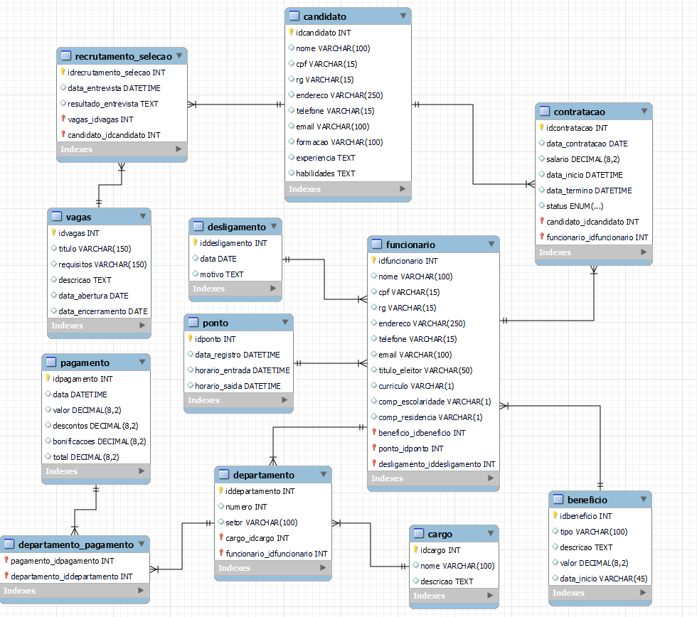
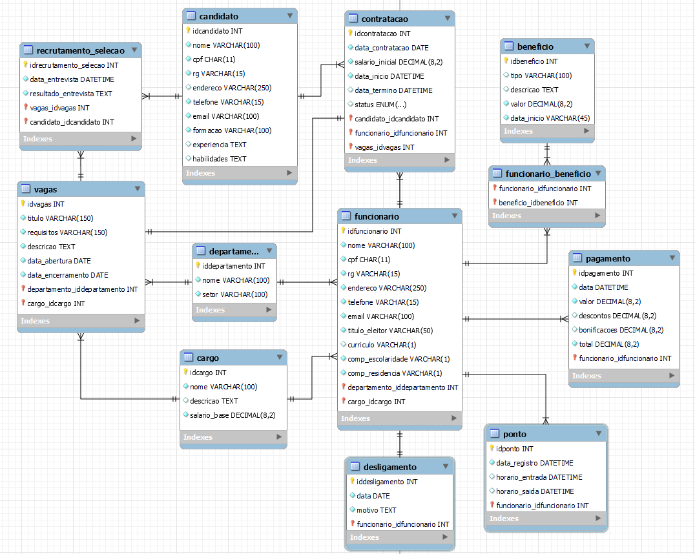

# Trabalho de Modelagem de Banco de Dados: Setor RH - Senac
- Alunos: Eduardo, Guilherme, Lorenzo, Marco Aurélio, Thiago de Souza.

## Criação do Primeiro Modelo 

## Criação do Segundo Modelo 

> #### Compreensão do Negócio:
> - Qual é o objetivo principal do sistema de banco de dados que estamos modelando?
> - Quais são as principais funções e processos dos setores do Senac que estamos representando?

O objetivo principal do sistema de banco de dados que estamos modelando para o setor de Recursos Humanos
é fornecer uma estrutura organizada, confiável e eficiente para gerenciar os dados do setor.
Com esse modelo, a equipe de RH pode acompanhar processos seletivos, monitorar a frequência e calcular corretamente os pagamentos
e benefícios da instituição.

Neste modelo temos as principais funções e processos do setor de Recursos Humanos,
após a entrevista com a colaboradora Tamiles do sertor de Recursos Humanos,
indentificamos que o modelo vai cobrir desde a abertura de vagas e o processo de recrutamento e seleção,
processos de contratação, e a gestão de funcionários, incluindo registro de ponto, pagamentos, seus benefícios, e o desligamento.

> #### Levantamento de Requisitos:
> - Quais são os principais dados que cada setor precisa armazenar e gerenciar?
> - Quais são as principais entidades e atributos que precisam ser modelados para cada setor?

> #### Relacionamentos entre Entidades:
> - Como as diferentes entidades estão relacionadas entre si dentro de cada setor?
> - Existem relacionamentos muitos-para-muitos que precisam ser identificados e tratados?

> #### Normalização e Estruturação:
> - Como podemos garantir que o banco de dados seja normalizado para evitar redundâncias e inconsistências?
> - Quais são as chaves primárias e estrangeiras que precisamos definir em nossas tabelas?

> #### Integridade e Restrições:
> - Quais são as restrições de integridade que precisamos aplicar para garantir a consistência dos dados?
> - Como lidaremos com restrições de integridade referencial entre tabelas?

As restrições ajudam a assegurar que os dados inseridos, atualizados ou deletados obedeçam a regras específicas, evitando assim a introdução de inconsistências.

- Uma delas é a integridade de entidade, onde cada tabela tem uma chave primária que identifica unicamente cada registro.
- Temos também as colunas que não podem ter valores nulos, são definidas com a restrição NOT NULL.
- As chaves estrangeiras(FOREING KEY), assegura que um valor em uma coluna ou conjunto de colunas corresponda a um valor em ua chave primária em outra tabela. 
- Além de ferramentas automatizadas para gestão de esquemas, assegurando que o banco de dados se mantenha íntegro e eficiente ao longo do tempo.

> #### Desenvolvimento e Manutenção:
> - Quais ferramentas e tecnologias podemos utilizar para desenvolver e manter o banco de dados?
> - Como planejamos realizar testes e implementar atualizações no banco de dados no futuro?

Utilizamos ferramentas de modelagem como Lucidchart e MySQL Workbench, este ultimo já se enquadra em um sistemas de gerenciamento de banco de dados(SGBDs), e decidiremos qual será a ferramenta de backup, e futuras ferramentas de integração, pois depende do projeto de software desenvolvido.

> #### Segurança e Acesso aos Dados:
> - Como podemos garantir a segurança dos dados e controlar o acesso a eles dentro de cada setor?
> - Quais são as políticas de acesso e permissões que precisamos estabelecer?

Vamos garantir a segurança dos dados com um gerenciamento de banco de dados(SGBDs), para gerenciar e atualizar todo o modelo e a base de dados, e um responsável que gerencie a Base de dados.

Será feito o controle de acesso por usuário conforme a hierarquia do setor de Recursos Humanos e entre os colaboradores envolvidos. E a definição dos deveres e responsabilidades de acesso de cada colaborador.

> #### Documentação e Comunicação:
> - Como vamos documentar o modelo de banco de dados para facilitar a compreensão e colaboração futura?
> - Qual é o plano de comunicação para garantir que todas as partes interessadas estejam alinhadas com o desenvolvimento do banco de dados?

Está base de dados vai ser documentada sempre com o modelo atualizado, caso haja alterações futuras será feita as devidas atualizações na documentação,
para que todos possam entender de forma objetiva tudo que o modelo propõe, facilitando alterações e integrações, entre outros processos envolvidos.
O modelo será desenvolvido no MySQL Workbench, desde a modelagem até a criação da Base de dados e futuras atualizações.

Um plano de comunicação bem estruturado entre todas as partes envolvidas, alinhando o desenvolvimento do modelo, e toda a integração do banco de dados e softwares. 

